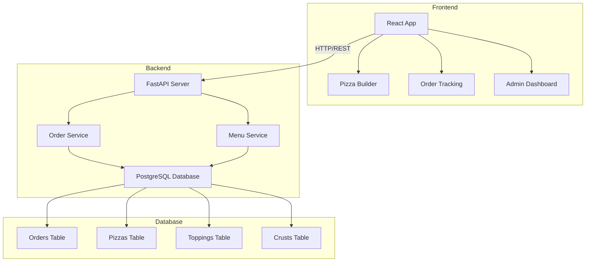

# Pizza Palace - Architecture Plan

## Overview
Pizza Palace is a full-stack pizza ordering application with a FastAPI backend and React frontend using IBM Carbon Design System.

## Technology Stack

### Backend
- **Framework**: FastAPI (Python)
- **Database**: PostgreSQL
- **ORM**: SQLAlchemy
- **Validation**: Pydantic
- **API Documentation**: Swagger UI (built-in with FastAPI)

### Frontend
- **Framework**: React
- **UI Library**: IBM Carbon Design System
- **State Management**: React Hooks (useState, useContext)
- **HTTP Client**: Axios
- **Routing**: React Router

## System Architecture



## Database Schema

### Tables

#### orders
- id (UUID, Primary Key)
- customer_name (VARCHAR)
- customer_phone (VARCHAR, indexed)
- customer_address (TEXT)
- status (ENUM: 'open', 'preparing', 'out_for_delivery', 'delivered', 'cancelled')
- total_price (DECIMAL)
- created_at (TIMESTAMP)
- updated_at (TIMESTAMP)

#### pizzas
- id (UUID, Primary Key)
- order_id (UUID, Foreign Key -> orders.id)
- size (ENUM: 'small', 'medium', 'large')
- crust_type (VARCHAR)
- base_price (DECIMAL)

#### pizza_toppings (junction table)
- pizza_id (UUID, Foreign Key -> pizzas.id)
- topping_name (VARCHAR)

#### available_toppings (reference data)
- name (VARCHAR, Primary Key)
- price (DECIMAL)

#### available_crusts (reference data)
- name (VARCHAR, Primary Key)
- price_modifier (DECIMAL)

## API Endpoints

### Order Management
- `POST /api/orders` - Create a new order
- `GET /api/orders/phone/{phone_number}` - Get orders by phone number
- `GET /api/orders/open` - List all open orders
- `GET /api/orders/{order_id}` - Get specific order details
- `PATCH /api/orders/{order_id}/status` - Update order status

### Menu Data
- `GET /api/menu/toppings` - Get available toppings
- `GET /api/menu/crusts` - Get available crust types
- `GET /api/menu/sizes` - Get available sizes with pricing

## Data Models

### Order Request
```json
{
  "customer_name": "John Doe",
  "customer_phone": "555-0123",
  "customer_address": "123 Main St, City, State 12345",
  "pizzas": [
    {
      "size": "large",
      "crust_type": "thin_crust",
      "toppings": ["pepperoni", "mushrooms", "extra_cheese"]
    }
  ]
}
```

### Order Response
```json
{
  "id": "uuid",
  "customer_name": "John Doe",
  "customer_phone": "555-0123",
  "customer_address": "123 Main St, City, State 12345",
  "status": "open",
  "pizzas": [...],
  "total_price": 24.99,
  "created_at": "2026-02-25T20:00:00Z"
}
```

## Pizza Configuration

### Sizes and Base Prices
- **Small**: $8.99
- **Medium**: $12.99
- **Large**: $16.99

### Crust Types
- **Thin Crust**: +$0.00
- **New York Style**: +$1.00
- **Deep Dish**: +$2.00
- **Cheese Stuffed**: +$3.00
- **Gluten Free**: +$2.50

### Available Toppings (each +$1.50)
- Pepperoni
- Italian Sausage
- Ham
- Bacon
- Ground Beef
- Grilled Chicken
- Mushrooms
- Green Peppers
- Red Onions
- Black Olives
- Tomatoes
- Spinach
- Jalapeños
- Pineapple
- Extra Cheese
- Feta Cheese

## Frontend Components Structure

```
src/
├── components/
│   ├── PizzaBuilder/
│   │   ├── SizeSelector.jsx
│   │   ├── CrustSelector.jsx
│   │   ├── ToppingSelector.jsx
│   │   └── PizzaSummary.jsx
│   ├── OrderForm/
│   │   ├── CustomerInfo.jsx
│   │   └── OrderConfirmation.jsx
│   ├── OrderTracking/
│   │   └── OrderStatus.jsx
│   └── Admin/
│       └── OpenOrdersList.jsx
├── services/
│   └── api.js
├── pages/
│   ├── Home.jsx
│   ├── BuildPizza.jsx
│   ├── TrackOrder.jsx
│   └── AdminDashboard.jsx
└── App.jsx
```

## Backend Project Structure

```
backend/
├── app/
│   ├── main.py
│   ├── database.py
│   ├── models/
│   │   ├── order.py
│   │   ├── pizza.py
│   │   └── menu.py
│   ├── schemas/
│   │   ├── order.py
│   │   ├── pizza.py
│   │   └── menu.py
│   ├── routers/
│   │   ├── orders.py
│   │   └── menu.py
│   └── services/
│       ├── order_service.py
│       └── menu_service.py
├── requirements.txt
└── .env
```

## User Flows

### Customer Order Flow
1. Customer lands on home page
2. Clicks "Build Your Pizza"
3. Selects pizza size
4. Chooses crust type
5. Adds desired toppings
6. Reviews pizza summary with price
7. Can add more pizzas or proceed to checkout
8. Enters customer information (name, phone, address)
9. Reviews complete order
10. Submits order
11. Receives order confirmation with order ID

### Order Tracking Flow
1. Customer clicks "Track Order"
2. Enters phone number
3. Views list of their orders with status
4. Can view details of each order

### Admin Flow
1. Admin accesses admin dashboard
2. Views all open orders
3. Can update order status
4. Sees order details including customer info and pizzas

## Security Considerations
- Input validation on all API endpoints
- SQL injection prevention via SQLAlchemy ORM
- CORS configuration for frontend-backend communication
- Rate limiting on API endpoints
- Phone number format validation
- Address validation

## Future Enhancements
- User authentication and accounts
- Payment processing integration
- Real-time order status updates via WebSockets
- Email/SMS notifications
- Delivery time estimation
- Order history and favorites
- Promotional codes and discounts
- Multiple locations support